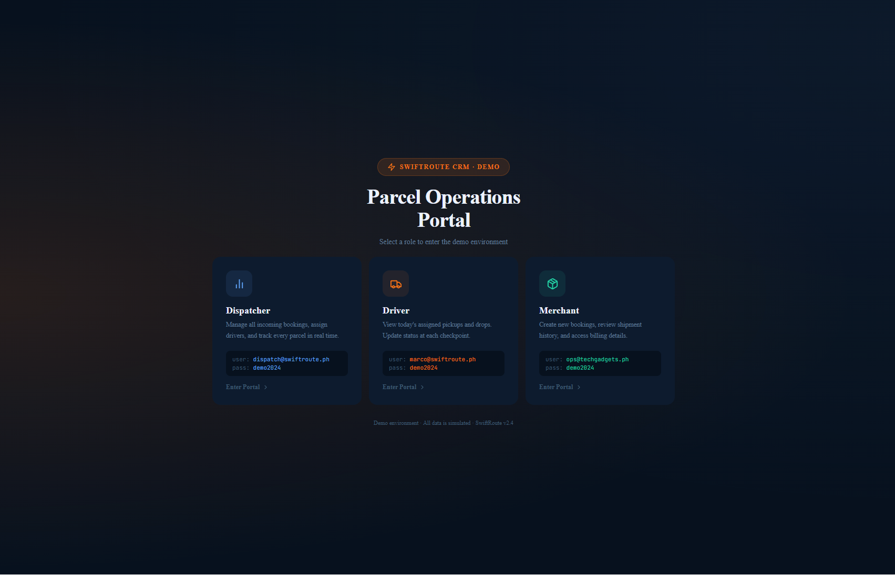

# SwiftRoute CRM — Demo (Vite + React)

## Screenshot



## Quick start

1. Install dependencies

```bash
# using npm
npm install

# or using pnpm
pnpm install
```

2. Run development server

```bash
# using npm
npm run dev

# or using pnpm
pnpm run dev
```

3. Build for production

```bash
# using npm
npm run build
npm run preview

# or using pnpm
pnpm run build
pnpm run preview
```

## Files of interest

- `package.json`
- `src/App.jsx`
- `src/main.jsx`

## CI

A GitHub Actions workflow is added at `.github/workflows/ci.yml` to run `pnpm install` and `pnpm run build` on push and pull requests.

## Debugging borders

To highlight every element's outline in the running app temporarily, open the dev server with the `debugBorders` query parameter:

```bash
# Start dev server
pnpm run dev

# Open in your browser:
http://localhost:5173/?debugBorders=1
```

This injects a temporary red outline around every element and does not change layout. Remove the query parameter to disable it.

## Notes

This is a small demo converted to a Vite React app. Use `pnpm install`, then `pnpm run dev` to preview locally.
